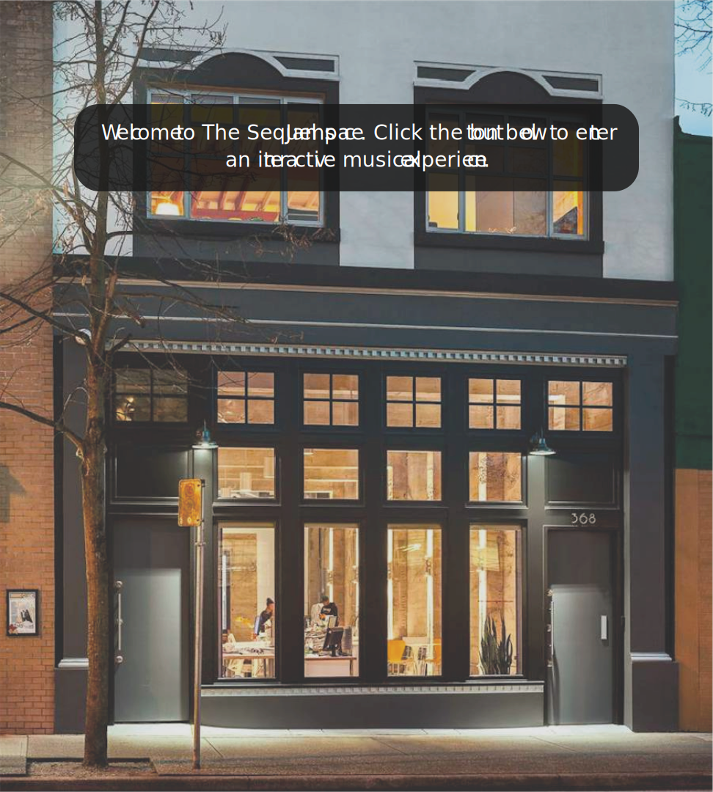

#Welcome to The Sequel Jamspace. Click the button below to enter an interactive musical experience.

 [//]: # "background image for landing page"

[//]: # "#enter-btn when clicked will lead inside of the studio." 

#Select instruments below to create your own band. Press play and dynamically adjust the volume sliders under each instrument to hear and change your custom jam.

 [//]: # "background image for landing page"

[//]: # "#reset-btn when clicked will allow users to change up the instruments of their custom band." 

[//]: # "everything in the studio will start off as black and white. There will be nine different voices/instruments that can be selected."

[//]: # "when selected, the object will change to a coloured visual."

[//]: # "user will press #play-btn which will overlay the different audio files selected to create a custom jam."

[//]: # "#play-btn will change to #pause-btn as the song is playing.#stop-btn will appear when play/pause is selected. This will stop and reload all audio to the beginning and resets all images to black and white."

[//]: # "#play-btn will indicate that song is currently playing."

[//]: # "all audio will be recorded by writer and pictures will be taken of writer's instruments. All visuals will then be placed in a custom UI created by writer."

[//]: # "user will be able to manipulate the different instruments with volume sliders underneath each instrument."

[//]: # "song will stop playing once all audio files have finished. All images return to black and white state."
